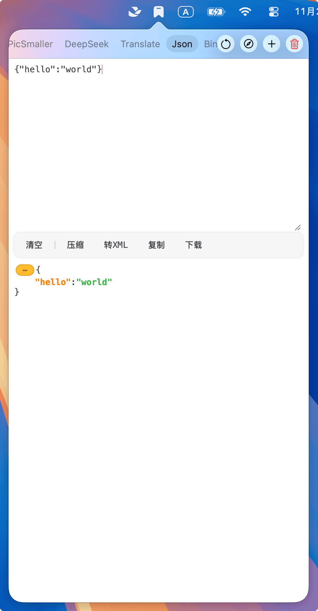
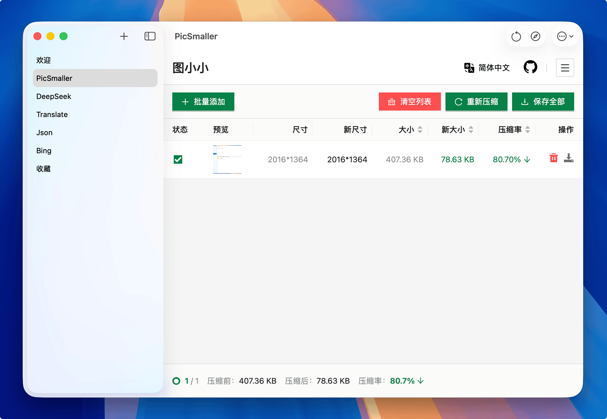
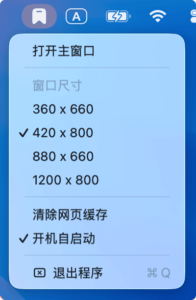

# TopMark 状态栏书签

这是一个由 AI 完成的项目，可以将自己高频使用的工具网页固定在状态栏，简单而实用。

## 状态栏窗口模式

使用场景示例：

- 近期常看的文档
- 友链、留言板
- 搜索引擎、网站导航
- [PicSmaller](https://picsmaller.com/)
- [DeepSeek](https://chat.deepseek.com/)
- [lobechat](https://lobechat.com/chat)
- [RSS Hub](https://app.folo.is/timeline/view-0/all/pending)
- [Google Translate](https://translate.google.com.hk)

> 为了快速访问，页面默认是预加载的，所以可以根据情况实时增删内容，不要一次性添加太多，占用额外的内存。

## 独立窗口模式

可以像普通应用一样使用普通窗口：

## 自定义选项

支持设置窗口尺寸、开机自启：

这是个开源项目，如果你喜欢，欢迎 Star 或贡献代码，和本人其它开源项目一样永久开源！大家有什么好用的玩法也可以留言分享。
